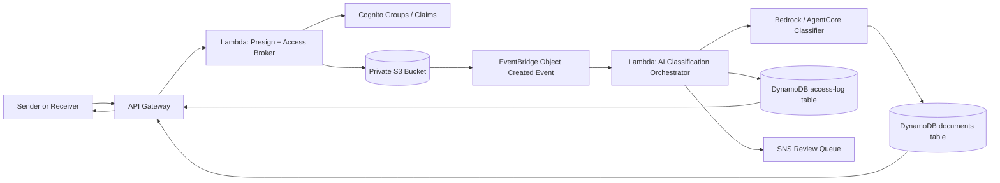

# File Secure Exchange: Advanced Delivery Plan

## 1. Product Goal

Build a secure document exchange platform for referral letters, insurance documents, prescriptions, invoices, and related session-attached files. The system must assume every document is sensitive, enforce least privilege by default, and produce an auditable trail for every upload, classification, download, and administrative action.

This plan upgrades the original outline into a delivery blueprint with explicit security guardrails, reusable Terraform patterns, AI-assisted controls, CI/CD policy enforcement, and a repository layout that is safe for both humans and coding agents to extend.

The scope is intentionally MVP-first: Phase 1 and Phase 2 are the only implementation commitments. Policy-as-code belongs in Phase 1 because it is cheap relative to its signal value. Phases 3 and 4 are roadmap items that belong in the README or ADR backlog until the core product is fully working, tested, and polished.

## 2. Design Principles

- Treat every object as sensitive by default.
- Make the secure path the only path.
- Decouple upload, classification, and review so failures are contained.
- Prefer reusable Terraform modules over one-off resources.
- Enforce policy mechanically in CI, not by code review alone.
- Keep auditability, traceability, and ownership metadata first-class.
- Use AI as a guardrail and metadata accelerator, not as an opaque business decision engine.
- Policies must never be stricter than the infrastructure they gate — if a control is deferred, the policy that enforces it is deferred with it, explicitly and on the record.

## 3. Target Architecture

### System Flow



### Service Map

| Layer | Service | Purpose | Notes |
|---|---|---|---|
| Storage | S3 | Private, versioned document storage | No public access, presigned upload/download only |
| API | API Gateway + Lambda | Session-aware access broker | Issues presigned URLs and enforces role/session checks |
| Auth | Cognito | Identity and group claims | Two groups: `sender` and `receiver` |
| Metadata | DynamoDB | Document registry and audit logs | `documents` and `access-log` tables |
| Encryption | S3 default encryption (SSE-S3) | MVP baseline; SSE-KMS with a customer-managed key is a documented hardening step, not a launch requirement | See ADR-0003 |
| Eventing | EventBridge | Asynchronous document processing | Upload event triggers classification and anomaly checks |
| AI | Bedrock / AgentCore | Document type classification and risk flagging | Reuses the ArchiveIQ event-driven pattern |
| Notifications | SNS | Review routing for flagged items | Routes suspicious uploads to human review |
| Audit | CloudTrail + S3 server access logs | Immutable access evidence | Supports compliance-oriented review trails |
| Edge protection | WAF | Roadmap item, not part of the MVP implementation |

## 4. Reuse Strategy from ArchiveIQ

This repo should reuse the successful ArchiveIQ pattern instead of reinventing it:

- Keep ingestion asynchronous and event-driven.
- Preserve the split between infrastructure modules and runtime handlers.
- Reuse the same Terraform module contracts for IAM, S3, Lambda, and DynamoDB where possible.
- Keep agent/classifier logic isolated in its own Lambda so the upload path stays fast.
- Use the same CI model: plan first, then policy gate, then cost visibility, then manual approval, then apply.

The key difference is that this system is not a generic document classifier. It is a security-first exchange surface, so the AI layer must act as a control plane for metadata and anomaly detection.

## 5. Infrastructure Plan

### Terraform Layers

| Layer | Contents | Reuse / Pattern |
|---|---|---|
| Root infra | Provider config, backend, variables, environment wiring | Mirror the ArchiveIQ Terraform split |
| Modules | S3, IAM, Lambda, DynamoDB, Cognito | Reuse existing module registry where available |
| Data | Policy documents, policy inputs, seed metadata | Keep JSON and policy files versioned |
| Lambdas | Presign broker, access auditor, AI classifier, notification processor | Separate by responsibility and blast radius |
| Policies | OPA/Rego plan gates | Treat policy as a product artifact |

### Proposed Root Structure

```text
file-secure-exchange/
├── terraform/
│   ├── modules/
│   ├── infra/
│   │   ├── s3.tf
│   │   ├── lambda.tf
│   │   ├── dynamodb.tf
│   │   ├── iam.tf
│   │   ├── cognito.tf
│   │   ├── eventbridge.tf
│   │   ├── kms.tf        # reserved for Phase 4 CMK hardening — not wired in yet
│   │   └── waf.tf        # reserved for Phase 4 edge protection — not wired in yet
├── lambdas/
│   ├── presign-handler/
│   ├── ai-classifier/
│   └── review-notifier/
├── policies/
│   ├── deny-public-s3.rego
│   ├── require-encryption.rego
│   ├── deny-iam-wildcard.rego
│   ├── require-tls.rego
│   └── require-tags.rego
├── docs/
│   ├── adr/
│   └── AGENTS.md
├── .github/workflows/
│   ├── plan-policy-cost.yml
│   └── apply.yml
└── README.md
```

## 6. Security Architecture

### Access Model

- `sender` can upload documents tied to the sessions they are authorized to service.
- `receiver` can only retrieve documents that belong to their own sessions.
- Every presigned URL request must be checked against session ownership, role claims, and document state.
- Download access is logged in DynamoDB before the presigned URL is returned.

### Encryption and Data Protection

- S3 uses SSE-S3 (server-side default encryption) in the MVP. SSE-KMS with a customer-managed key is a documented hardening step (ADR-0003), not a launch requirement.
- DynamoDB encryption must be enabled and managed by the platform baseline.
- TLS must be enforced end to end.
- Public access must be blocked at the bucket and policy layer.
- Sensitive document metadata must not be placed in plaintext logs or notification payloads.

### Audit and Compliance Posture

- Store immutable access events in DynamoDB and CloudTrail-backed logs.
- Capture who requested the file, when, from what session, and whether access was granted or denied.
- Log classification decisions and PHI-risk flags separately from user-facing notifications.
- Keep retention explicit and documented for every audit surface.

## 7. AI Guardrail Design

The AI layer should mirror the ArchiveIQ pattern but move from classification-only to classification-plus-risk detection.

### Upload Event Pipeline

1. Upload lands in private S3.
2. EventBridge emits an object-created event.
3. A classification Lambda validates the object metadata, size, and content expectations.
4. The Lambda invokes a Bedrock or AgentCore-based classifier.
5. The classifier writes document type, confidence, and risk annotations to DynamoDB.
6. If the object looks suspicious, the system routes it to a human review queue via SNS instead of treating it as a silent success.

### Classification Outputs

- Document type: referral letter, invoice, clinical note, insurance form, prescription, or unknown.
- Confidence score and extraction notes.
- PHI-risk signals: missing encryption context, unexpected MIME type, suspicious size, malformed metadata, or policy mismatch.
- Review state: accepted, flagged, or needs manual review.

### Why This Belongs Off the Upload Path

- It keeps user-facing upload latency low.
- It isolates AI failure from document ingestion failure.
- It allows retries and review routing without re-running the upload transaction.
- It makes the AI control surface observable and testable on its own.

## 8. Data Model

### `documents` Table

Suggested fields:

- `document_id`
- `session_id`
- `owner_id`
- `uploader_id`
- `receiver_id`
- `s3_key`
- `document_type`
- `classification_status`
- `confidence_score`
- `risk_flag`
- `encryption_type` — records `SSE-S3` or `SSE-KMS`; populated as `SSE-S3` until CMK hardening lands
- `kms_key_id` — nullable; populated only once SSE-KMS is implemented (Phase 4)
- `created_at`
- `updated_at`

### `access-log` Table

Suggested fields:

- `access_id`
- `document_id`
- `session_id`
- `principal_id`
- `principal_role`
- `action`
- `result`
- `source_ip`
- `requested_at`
- `granted_at`
- `deny_reason`

## 9. Five OPA / Rego Policies

### 1. Deny Public S3

Reject buckets with public ACLs, public bucket policies, or missing Block Public Access controls.

Reasoning: document exchange systems fail catastrophically when storage is even accidentally public.

### 2. Require Encryption at Rest

Require S3 server-side encryption (SSE-S3 or SSE-KMS) and DynamoDB encryption to be enabled. Does not require a customer-managed key in the MVP.

Reasoning: explicit encryption-at-rest is table stakes for sensitive documents. The policy matches the MVP baseline (SSE-S3); it will be tightened to require SSE-KMS specifically once customer-managed keys are implemented as a hardening step (ADR-0003), so the CI gate never fails against infrastructure the plan itself defers.

### 3. Deny IAM Wildcards

Reject policies with `Action = "*"` or `Resource = "*"` on Lambda and other runtime roles.

Reasoning: wildcard IAM is a frequent audit finding and should be mechanically blocked.

### 4. Require TLS in Transit

Reject bucket policies that do not deny requests when `aws:SecureTransport` is false.

Reasoning: encryption at rest is incomplete without enforced transport security.

### 5. Require Mandatory Tags

Require `owner`, `environment`, and `data-classification` tags on every managed resource.

Reasoning: ownership, environment, and sensitivity classification should be queryable from the infrastructure layer itself.

## 10. CI / CD Flow

### Pull Request Path

1. `terraform fmt` and `terraform validate` run first.
2. `terraform plan` is generated.
3. The plan is evaluated by `evaluate-terraform-policies` or an equivalent OPA gate.
4. The PR cannot merge if a security policy fails.

### Main Branch Path

1. Merge to `main` after approval.
2. Re-run plan and policy checks.
3. Apply only after a clean gate.

### Optional Demo Surface

- Publish a small static demo page from S3 and CloudFront only after the MVP is stable.
- Simulate upload, classification, review flagging, and audit-log writeback.
- Treat it as a nice-to-have presentation layer, not a release blocker.

## 11. ADRs

### ADR-0001: Policy-as-Code Enforcement Between Plan and Apply

**Context**: The platform handles sensitive documents and needs guardrails that cannot be bypassed by habit or review fatigue.

**Decision**: Gate `terraform plan` output through OPA/Rego before any apply step.

**Consequences**: Policies are portable, testable, reusable across repositories, and independent from Terraform provider internals.

### ADR-0002: Async Classification via EventBridge

**Context**: Upload requests should stay fast and resilient even when AI services are slow or temporarily unavailable.

**Decision**: Trigger classification asynchronously from EventBridge rather than inline in the upload Lambda.

**Consequences**: Lower latency, smaller blast radius, better retry handling, and cleaner separation of concerns.

### ADR-0003: SSE-S3 for MVP, Customer-Managed KMS as a Documented Hardening Step

**Context**: Customer-managed KMS keys add real operational surface — key policy, rotation, cross-service grants — for marginal signal gain over default encryption in an MVP timeframe.

**Decision**: Ship the MVP on S3 default encryption (SSE-S3) with DynamoDB encryption enabled by default. Scope SSE-KMS with a customer-managed key as an explicit, documented Phase 4 hardening step, and keep the encryption-at-rest OPA policy aligned to whichever tier is actually deployed at each stage.

**Consequences**: Faster, lower-risk MVP delivery; the CI policy gate never contradicts the infrastructure it's enforcing; the upgrade path to CMK is planned rather than retrofitted.

## 12. Implementation Phases

### Phase 1: Secure Skeleton

- Create the Terraform root structure.
- Stand up private S3 with default encryption, DynamoDB, IAM, and Cognito foundations.
- Add the access-broker Lambda and presigned URL flow.
- Wire audit logging before user-facing retrieval is enabled.
- Add OPA/Rego policy files and wire the CI plan gate from day one.
- Fail the PR if plan output violates the security policies.

### Phase 2: Event-Driven Intelligence

- Add EventBridge and the AI classifier Lambda.
- Persist classification metadata to DynamoDB.
- Add SNS review routing for PHI-risk anomalies.

### Phase 3: Roadmap Only

- Add Infracost reporting when you want cost governance to become part of the release process.
- Add a lightweight demo surface only if it materially helps stakeholder review.

### Phase 4: Hardening Roadmap

- Implement SSE-KMS with a customer-managed key; tighten Policy #2 to require it specifically once deployed.
- Add WAF, retention controls, and alerting after the MVP ships.
- Expand tests only after the first end-to-end flow is passing.
- Document extension points in `AGENTS.md` so humans and coding agents follow the same rules.

## 13. Acceptance Criteria

- No public access path exists to any document bucket.
- Every upload and download creates an audit event.
- A receiver cannot fetch another receiver's documents.
- Classification metadata is written asynchronously.
- PHI-risk anomalies are routed to review instead of silently accepted.
- Terraform changes cannot merge if they violate the OPA policies — including the encryption-at-rest policy, which passes against the MVP's actual SSE-S3 baseline.
- The MVP includes only a small, concrete test surface: presign success, unauthorized access denial, audit-log write, and async classification trigger.

### Roadmap Criteria

- Resource ownership and data classification are visible in tags.
- Infracost, WAF, demo page, manual approval flow, CMK encryption, and expanded tests remain documented follow-ons rather than launch blockers.

## 14. What Makes This Better Than the Original Outline

- It turns the broad architecture into an execution-ready sequence.
- It adds explicit data flow, policy gating, and review routing.
- It introduces a reusable AI guardrail pattern instead of vague "AI features."
- It treats docs, conventions, and policy rules as part of the product surface.
- It makes the repository easier for both humans and agents to extend safely.
- Its policy gate is honest against its own infrastructure at every phase, rather than aspirational.